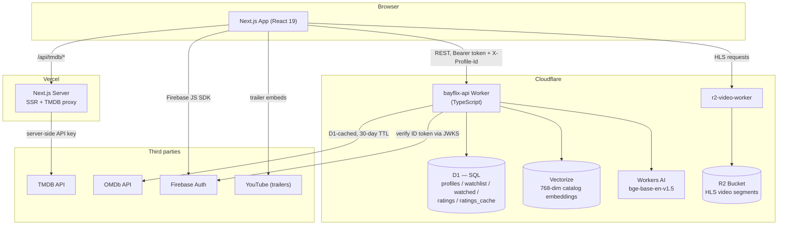
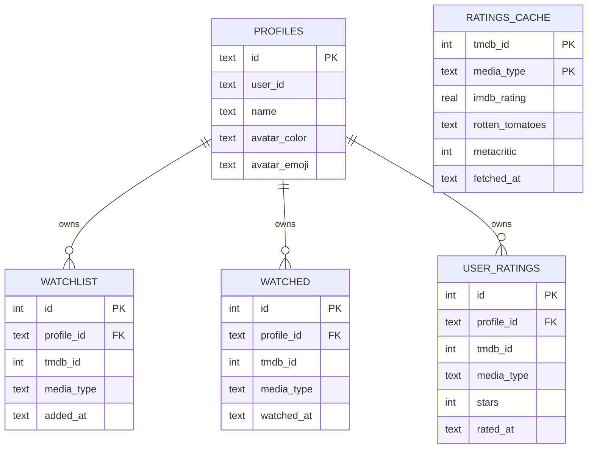
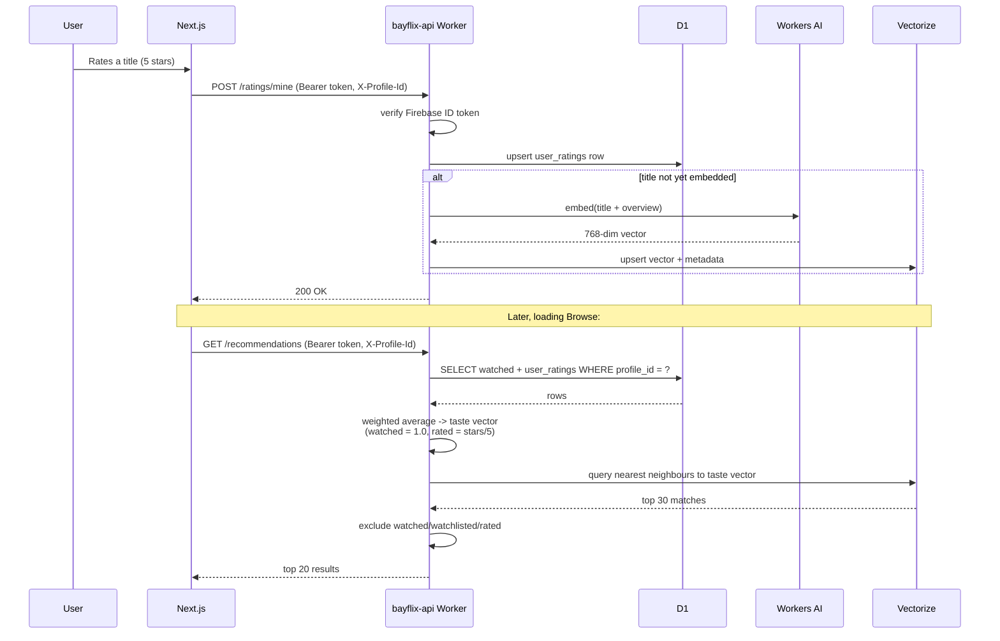

# Bayflix

A full-stack, Netflix-style streaming browser built as a portfolio/learning project — real authentication, a custom HLS video player, AI-powered semantic search and recommendations, and a Netflix-caliber UI, all running on free-tier infrastructure.

**Live:** [bayflix.ayushgurung.com](https://bayflix.ayushgurung.com)

> Bayflix is a demo/portfolio project. Movie and TV metadata comes from [TMDB](https://www.themoviedb.org/); it does not host or distribute licensed film content. The in-app player streams a single demo asset over HLS to demonstrate real video-player engineering (adaptive quality, custom controls, scrubbing) — it is not a way to watch the catalog's actual movies and shows.

---

## Features

**Browsing & discovery**
- TMDB-powered catalog: trending, popular, top rated, upcoming, now playing, per-genre
- AI semantic search — describe a plot in plain English ("a heist crew pulls one last job") and get relevant matches, not just keyword hits
- Personalized recommendations built from a weighted taste vector (watched + star ratings), not just "more of what's trending"
- Netflix-style hover previews (trailer autoplay) and an ambient autoplaying hero trailer, both pausing automatically when scrolled out of view
- IMDb / Rotten Tomatoes / Metacritic / TMDB ratings, cached in D1 to stay within OMDb's free-tier quota regardless of traffic
- TMDB certification (PG-13/R/TV-MA), watch-provider availability (JustWatch data via TMDB), user reviews, and full season/episode browsing for TV
- Cast pages with filmography, linked from every title

**Personalization**
- Real Firebase authentication (email/password + Google)
- Netflix-style multi-profile support — up to 5 profiles per account, each with its own watchlist, watched history, ratings, and recommendation taste vector
- 5-star personal ratings feeding directly into the recommendation model

**Playback**
- Custom HLS player (hls.js) with adaptive quality, audio/subtitle track switching, scrubbing with live thumbnail time, and network-condition-aware quality badges
- Served from a dedicated Cloudflare Worker + R2 bucket, independent of the main app

**Engineering details worth noting**
- Firebase ID tokens are verified from scratch in the Worker (JWKS fetch + RS256 signature verification via the Web Crypto API) — no auth SDK on the backend
- The entire stack (frontend + both Workers) is TypeScript, strict mode
- Every third-party embed (YouTube trailers) is hardened against real failure modes hit in production: embedding-disabled videos, browser autoplay policy, and stacking-context bugs from overlapping hover cards

---

## Architecture

### High-level design

Three independent deployables, each doing one job:



| Deployable | Where it runs | Responsibility |
|---|---|---|
| **Next.js app** | Vercel | UI, auth (client-side Firebase), TMDB reverse proxy (keeps the API key server-side), everything the user sees |
| **`bayflix-api` Worker** | Cloudflare Workers | Profiles, watchlist/watched/ratings, semantic search, recommendations, OMDb rating cache — the app's actual backend |
| **`r2-video-worker`** | Cloudflare Workers + R2 | Serves the HLS manifest/segments for the in-app player — deliberately separate from `bayflix-api`, since video serving and app-data serving have nothing to do with each other |

Nothing here is a paid tier: Vercel's hobby plan, Cloudflare's Workers/D1/Vectorize/Workers AI free tiers, TMDB's free API, and OMDb's free 1,000-req/day tier (protected by the D1 cache below).

### Low-level design

**Auth** — the Worker never trusts a token at face value. On every authenticated request it fetches Google's public JWKS, verifies the token's RS256 signature against it using the Web Crypto API, and checks issuer/audience/expiry — all written from scratch (`src/verifyFirebaseToken.ts`), no server-side auth SDK.

**Multi-profile data model** — one Firebase account can have up to 5 profiles. Every watchlist/watched/rating row is keyed by `profile_id`, not just `user_id`, so each profile builds an independent taste vector and gets independently personalized recommendations. Requests carry the active profile via an `X-Profile-Id` header; omitting it falls back to the account's own uid (its implicit default profile), so older clients never break.



**Recommendation pipeline** — the actual "AI" part. A title only needs to be watched or rated once by *anyone* to enter the shared Vectorize catalog; after that, every profile's recommendations are just vector math against it.



**Semantic search** works the same way in reverse: the query text itself gets embedded and matched against the same Vectorize index — no keyword matching involved, so a description like "a heist crew pulls one last job" can surface a heist movie that never uses that word in its title or overview.

**OMDb quota protection** — `ratings_cache` is a shared, title-keyed cache (not per-user) with a 30-day TTL. A title is fetched from OMDb at most once a month regardless of how many times it's viewed, which is what keeps a public-facing app inside OMDb's 1,000-request/day free tier no matter the traffic.

**Trailer embeds** — hardened after hitting three real production failure modes: (1) the YouTube IFrame Player API's internal `postMessage` heartbeat doesn't tear down cleanly under rapid mount/unmount (hover-triggered card previews), so those use a plain iframe instead; (2) some trailers have embedding disabled by their uploader, which surfaces as YouTube's own fallback UI *inside* the iframe — undetectable and unfixable from a plain iframe, so the Hero/detail-page trailers (which mount once, not per-hover) use the real Player API specifically so a failed embed can be caught and gracefully hidden; (3) an absolutely-positioned hover popup was getting cropped by its neighboring card because CSS z-index only competes within the same stacking context — fixed by dynamically promoting the whole card's stacking context while its preview is open.

---

## Tech stack

| Layer | Technology |
|---|---|
| Framework | Next.js 16 (App Router), React 19, TypeScript (strict) |
| Styling / motion | Tailwind CSS v4, Framer Motion, Lenis (smooth scroll) |
| Auth | Firebase Authentication |
| Backend | Cloudflare Workers (TypeScript), D1 (SQL), Vectorize (vector DB), Workers AI |
| Video | hls.js, Cloudflare Workers + R2 |
| External data | TMDB API, OMDb API |
| Hosting | Vercel (app), Cloudflare (both Workers) |

---

## Project structure

```
app/                    Next.js App Router routes
  (app)/                Authenticated routes (Navbar/MobileNav chrome)
    browse/             Home dashboard
    movie/[id], tv/[id] Detail pages
    person/[id]         Cast member pages
    search/, watchlist/, profile/, category/[slug]/
  profiles/             "Who's watching" profile picker
  watch/[id]/           Full-screen HLS player
  api/tmdb/[...path]/   Server-side TMDB proxy (hides the API key)

components/             UI components (~40), one concern each
lib/                    Client-side data/auth/API helpers, React contexts
cloudflare-worker/
  bayflix-api/          The actual backend — see its own README
  r2-video-worker.js    HLS video serving worker
```

See [`cloudflare-worker/bayflix-api/README.md`](cloudflare-worker/bayflix-api/README.md) for the Worker's own endpoint reference and deploy steps.

---

## Getting started

```bash
npm install
cp .env.example .env.local   # fill in TMDB/Firebase/Worker URLs — see comments in the file
npm run dev
```

The `bayflix-api` Worker and R2 video worker are deployed separately (see their own directories under `cloudflare-worker/`); the app degrades gracefully without them — profiles, watchlist, ratings, search, and recommendations simply stay hidden until `NEXT_PUBLIC_BAYFLIX_API_BASE_URL` is set.

```bash
npm run build   # production build
npm run lint    # ESLint
```

## Deployment

- **Next.js app** — Vercel, auto-deploys on push to `main`.
- **`bayflix-api`** — `cd cloudflare-worker/bayflix-api && npm run deploy` (Wrangler). Requires D1/Vectorize bindings provisioned once (see its README) and `ADMIN_KEY`/`OMDB_API_KEY` secrets set via `wrangler secret put`.
- **`r2-video-worker`** — deployed independently against its own R2 bucket binding.
